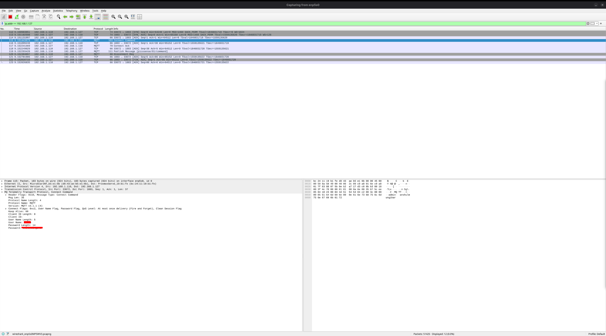
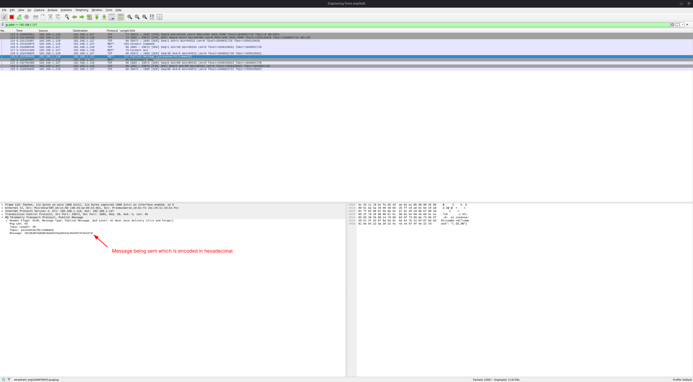

# Finding: PICO-MQTT-002

## Issue:
Anyone can spy on the data being sent. 

## Impact:
The attacker can see the sensitive data being sent.
## Root cause:
There is no encryption while sending the data to the broker or subscriber.

## Remediation:
Encrypting the messages before sending them. We can use TLS on port 8883, which encrypts the data in transit.

## Evidence
**Method:**
Captured network traffic using Wireshark on Fedora.
- Interface: `enp5s0`
- Filter: `ip.addr == <broker-ip>`

**Result:**
The following data was visible in plaintext:
- MQTT username and password used for authentication
- Topic name
- Message payload in hex, which converts to readable message being sent.

**Screenshots:**

**Conclusion:**
With this information an attacker can send their own messages which defeats the whole point of authentication. 
